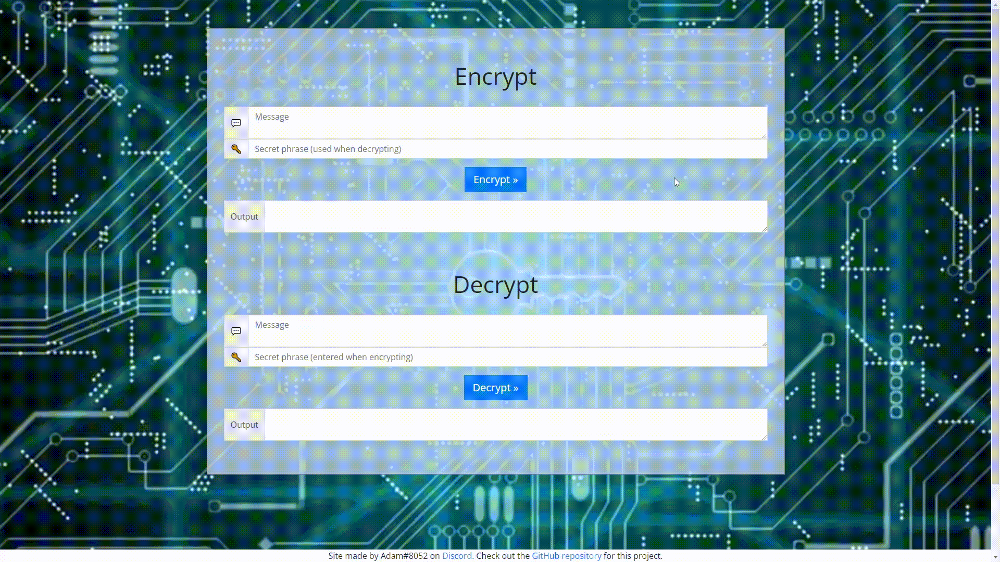

# Symmetric-key encryption and decryption
## _Powered by CryptoJS_

This project is a Javscript-powered method of encrypting messages that works solely in the browser.

- Uses AES [(Advanced Encryption Standard)](https://en.wikipedia.org/wiki/Advanced_Encryption_Standard) encryption to secure messages

## License

MIT
