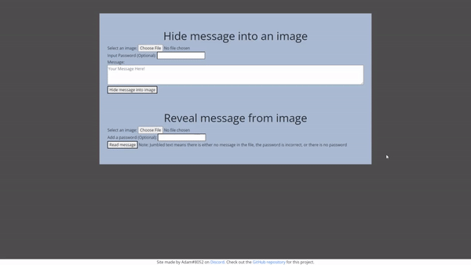

# Steganography

This project is a Javscript-based method of encoding and decoding encrypted messages into images

- Scripts are from (petereignschink's javascript library)[https://github.com/petereigenschink/steganography.js/]
- Uses SHA2 [(Secure Hash Algorithm)](https://en.wikipedia.org/wiki/SHA-2) encryption to secure messages

## License

MIT

## Contact

Adam#8052 on [Discord](https://discord.com/)